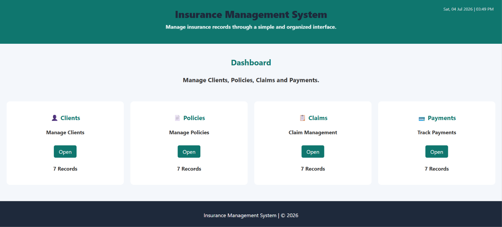
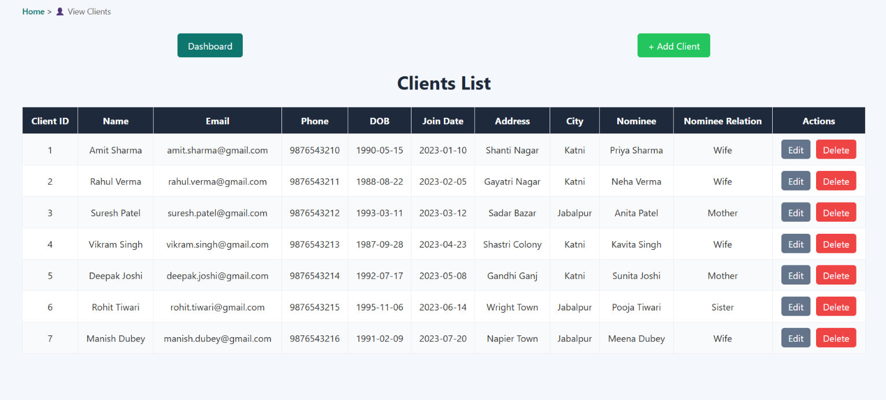
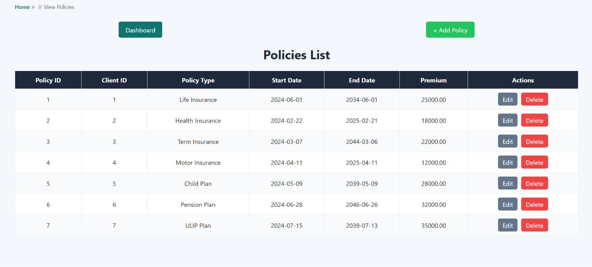
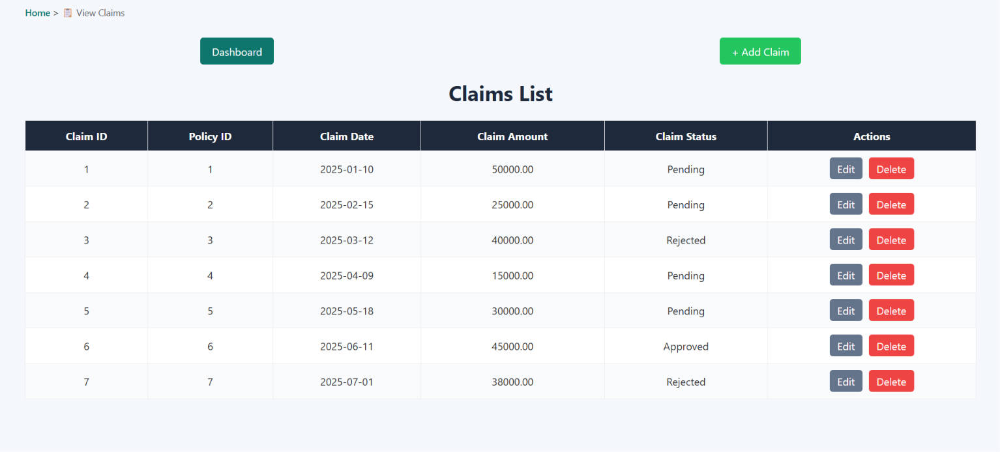
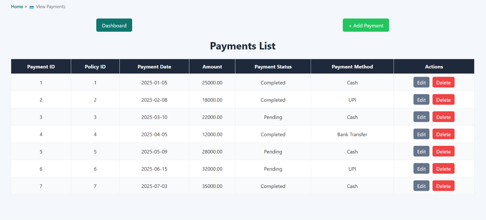
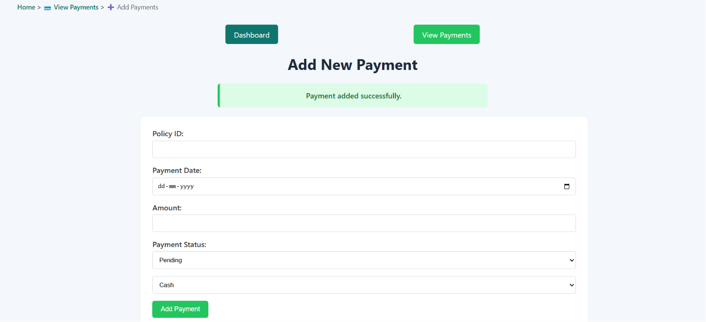
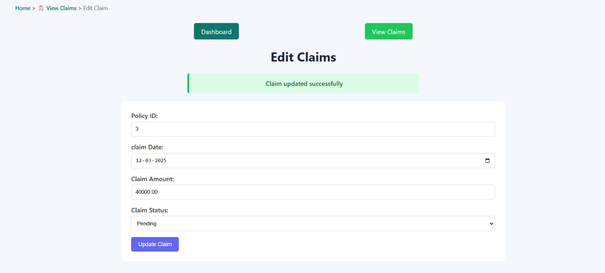
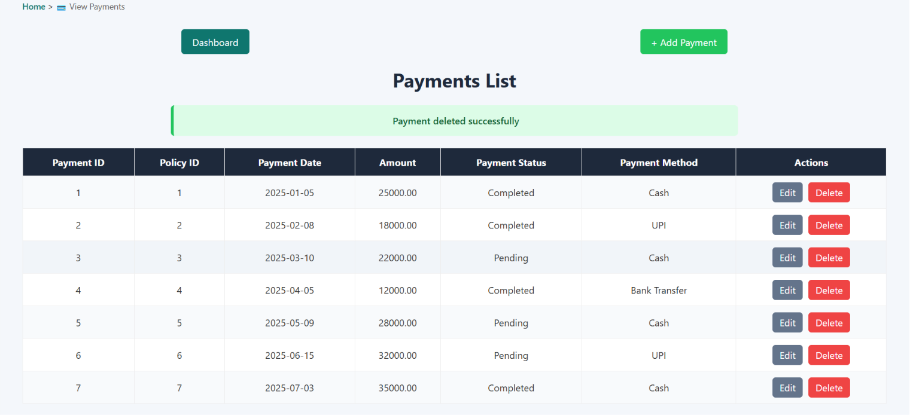

# Insurance Management System

A web-based Insurance Management System developed using PHP, MySQL, HTML, and CSS. The system provides complete CRUD functionality for managing clients, insurance policies, claims, and payments through a clean dashboard interface.

---

## Features

### Client Management

* Add new clients
* View client records
* Update client information
* Delete clients
* Email uniqueness validation

### Policy Management

* Add insurance policies
* Assign policies to clients
* Edit policy details
* Delete policies

### Claim Management

* Register claims
* Track claim status
* Update claim information
* Delete claims

### Payment Management

* Record payments
* Update payment status
* View payment history
* Delete payment records

### User Interface

* Dashboard with navigation cards
* Breadcrumb navigation
* Responsive design
* Success and error notifications
* Confirmation before deletion
* Consistent color theme

---

## Technologies Used

* PHP
* MySQL
* HTML5
* CSS3
* XAMPP
* Git
* GitHub

---

## Database Design

### Tables

* Clients
* Policies
* Claims
* Payments

### Relationships

* One Client → Many Policies
* One Policy → Many Claims
* One Policy → Many Payments

Foreign keys and cascading deletes are implemented to maintain data integrity.

---

## Project Structure

```text
InsuranceManagement/

├── clients/
├── policies/
├── claims/
├── payments/
├── db_config.php
├── index.php
├── styles.css
├── footer.php
├── header.php
└── README.md
```

---

## Installation

### Clone Repository

```bash
git clone https://github.com/yourusername/insurance-management-system.git
```

### Import Database

Import the SQL file into MySQL.

```sql
insurance_management.sql
```

### Configure Database

Update database credentials in:

```php
db_config.php
```

### Run Project

Place the project folder inside:

```text
xampp/htdocs/
```

Start:

* Apache
* MySQL

Open:

```text
http://localhost/InsuranceManagement/
```

---

## Screenshots

Add screenshots inside a folder named:

```text
screenshots/
```

Example:

* Dashboard
* Clients Module
* Policies Module
* Claims Module
* Payments Module

---

## Future Enhancements

* Search functionality
* Pagination
* Policy renewal reminders
* Authentication system
* Analytics dashboard
* Report generation

---

## Screenshots

## Screenshots

### Dashboard


### Clients List Module


### Policies List Module


### Claims List Module


### Payments List Module


### Add Data Module


### Edit Data Module


### Delete Data Module



---

## Author

Shivam Lakhera

B.Sc. Graduate | PHP & MySQL Developer
